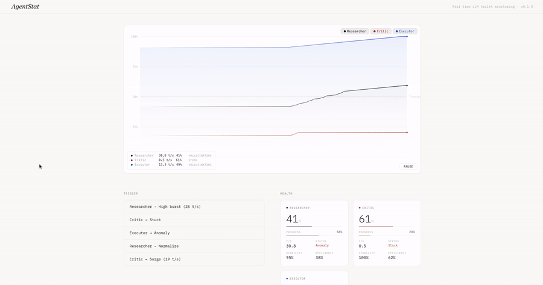

# AgentStat

<!--
  Badges — uncomment after the first `npm publish`. These hit npm's registry
  for real-time numbers, so they'll 404 until the package actually exists.

  [](https://www.npmjs.com/package/agentstat)
  [](https://bundlephobia.com/package/agentstat)
  [](https://www.npmjs.com/package/agentstat)
  [](./LICENSE)
-->

**Real data. Beautiful charts.**  
A lightweight, canvas-powered React component for live LLM and agent monitoring.

<!--
  Demo recording — replace demo.gif with a ~30s screen capture of
  `npm run dev` showing the live chart animating and the trigger buttons
  driving status/progress. Recommended: 800×450, < 2MB, loop silently.
  Placeholder is intentionally left here so a missing GIF renders as
  alt text, not a broken image icon.
-->


Visually stunning, buttery-smooth performance with Catmull-Rom splines, pulsing live dots, automatic health scoring, and a calm, production-ready aesthetic.

---

## Quick Start

```bash
npm install @dan-build/agentstat
```

A live-animating chart in four lines, with the built-in simulation and a ready-made roster of demo agents:

```tsx
'use client';
import { AgentStat, demoAgents } from '@dan-build/agentstat';

export default function Demo() {
  return <AgentStat agents={demoAgents} simulateData height={400} />;
}
```

That's it. No agent objects to construct, no ref, no wiring. Use this to verify the install and see what the component looks like.

When you're ready for your own agents, `createAgent(id, name, color?)` fills in the structural defaults so you only name what matters:

```tsx
import { AgentStat, createAgent } from '@dan-build/agentstat';

const agents = [
  createAgent('chat-agent', 'Chat Assistant', '#1d4ed8'),
  createAgent('planner',    'Planner',        '#B91C1C'),
];

export default function MyMonitor() {
  return <AgentStat agents={agents} simulateData height={400} />;
}
```

> **⚠️ Memoize your `agents` array.** Either wrap it in `useMemo` or declare it at module scope. AgentStat treats `agents` as the *roster* — which agents exist and in what order — and reads runtime values (`tokensRate`, `progress`, `status`, `visible`) from its own internal store, which is updated by `ref.current.updateAgent(...)`. Passing a fresh array literal on every render is fine **as long as the id list doesn't change**; if it does, any per-agent state for ids that were added/removed is resynced. Use `updateAgent` for runtime values — changes to `color`, `config`, etc. on existing agents via the `agents` prop are not applied.

---

## Production

In production, AgentStat visualises your real telemetry — it does **not** simulate data. `simulateData` defaults to `false`; push live metrics imperatively via the ref:

```tsx
'use client';

import { useRef } from 'react';
import { AgentStat, type Agent, type AgentStatRef } from '@dan-build/agentstat';

const agent: Agent = {
  id: 'chat-agent',
  name: 'Chat Assistant',
  color: '#1d4ed8',
  data: [],
  current: { tokensRate: 0, progress: 0, status: 'active' },
  visible: true,
};

export default function MonitoredChat() {
  const ref = useRef<AgentStatRef>(null);

  // Wire this up to your telemetry source (Vercel AI SDK, LangChain, WS/SSE, MCP, …).
  // ref.current?.updateAgent('chat-agent', tokensPerSecond, progressPercent, 'active');

  return (
    <AgentStat
      ref={ref}
      agents={[agent]}
      simulateData={false}
      height={560}
    />
  );
}
```

See the full integration guide for ready-made patterns:  
**[→ Real Data Integration](https://agentstat.sdaniel.cc/docs/real-data-integration)** — Vercel AI SDK (`useCompletion`), LangChain / LangGraph, WebSocket / SSE, Model Context Protocol (MCP), VS Code extensions.

---

## Features

- **Buttery smooth curves** — Catmull-Rom splines with zero jitter
- **Live pulsing dot** with soft glow and area fill
- **Automatic health scoring** — token efficiency, stability, hallucination risk, latency trend
- **Multi-agent support** with individual visibility toggles
- **Hover tooltips & click callbacks**
- **Fully imperative ref API** — works perfectly with Vercel AI SDK, LangChain, WebSocket, MCP, etc.
- **Retina-ready & performant** — built for long-running production monitoring

> **History window (v0.1):** the chart shows the most recent ~420 samples per agent. The on-screen time span therefore depends on how frequently you call `updateAgent(...)` (e.g. ~20s at 20 Hz, ~80s at 5 Hz). A configurable time window is planned for v0.2.

---

## Browser support

AgentStat uses Canvas2D and modern CSS color syntax (`rgb(r g b / alpha)`). This means effectively **Chromium 111+, Firefox 113+, Safari 16.4+** (all shipped in 2023). If you need to support older browsers, pin to a transpile target that polyfills these.

---

## Documentation

- [Overview & Features](https://agentstat.sdaniel.cc/docs/overview)
- [Real Data Integration](https://agentstat.sdaniel.cc/docs/real-data-integration)
- [API Reference](https://agentstat.sdaniel.cc/docs/api-reference)
- [Examples](https://agentstat.sdaniel.cc/docs/examples)

---

## License

MIT © [dan-build](https://github.com/dan-build)
---
